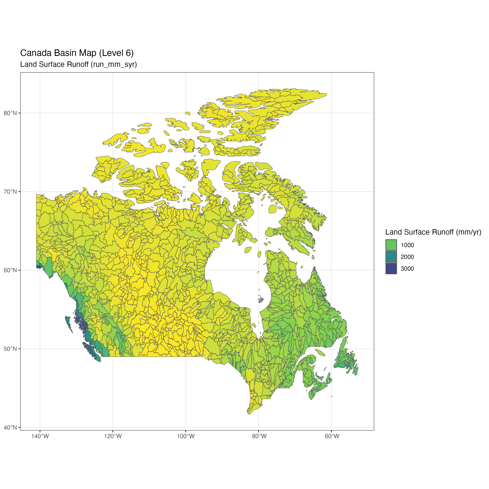
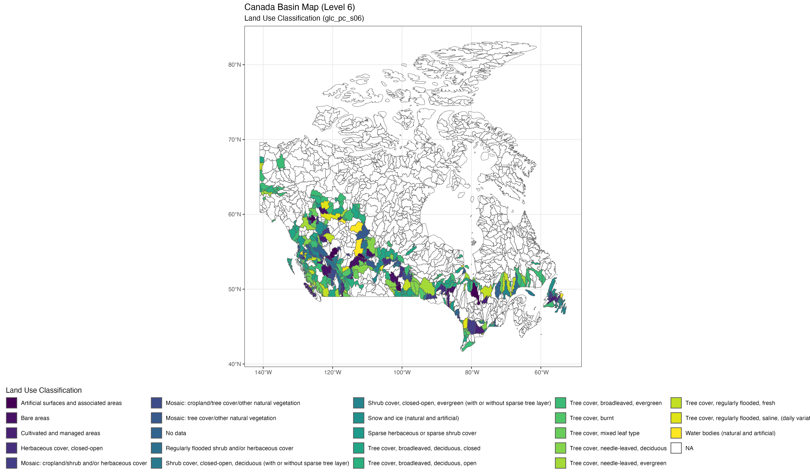

# An exploratory analysis of BasinATLAS data.

Name and contact: Elise Gallois, elise.gallois94\@gmail.com

Date and time completed: Monday 30th September 2-4pm.

## Workflow

### 1. Downloading and cleaning the data

-   I downloaded the data from [BasinATLAS](https://figshare.com/ndownloader/files/20082137) in GDB format.

Reference: Linke, S., Lehner, B., Ouellet Dallaire, C., Ariwi, J., Grill, G., Anand, M., Beames, P., Burchard-Levine, V., Maxwell, S., Moidu, H., Tan, F., Thieme, M. (2019). Global hydro-environmental sub-basin and river reach characteristics at high spatial resolution. Scientific Data 6: 283. doi: [**https://doi.org/10.1038/s41597-019-0300-6**](https://doi.org/10.1038/s41597-019-0300-6)

-   I saved the data in in this GitHub repo and preserved metadata in the data folder.

-   I used 'str' to examine the columns and structure of the data, and cross-checked against the technical documnent and the 'Legend' CSV.

-   There were multiple sub-basin levels to choose from to visualise the data. In the interest of time for this challenge I chose Level 6 because it showed fairly high spatial resolution while still being lightweight enough to work with.

-   I chose to filter to one country (Canada) to make data visualisation easier and quicker, particularly given the time constraints of the challenge.

### 2. Exploring the data and choosing variables

-   I wanted one categorical and one numerical variable for this data challenge, and the most interesting variables I saw were land-surface run-off and land use classification.

-   I merged with the 'Legends' spreadsheet to obtain the names of the land use types.

-   Surface run-off is important because it is a major pathway for the transport of pollutants such as agricultural nutrients and heavy metals to waterways. Higher surface run-off may also promote higher levels of soil erosion.

-   Land use is important because it determines the source of any pollutants from surface run-off, and also determines how the run-off interacts with the environment.

-   After filtering the data I save a CSV and RDS of the filtered Canada data including only the geometry and variables of interest.

### 3. Visualising the data

Using the 'sf' ad 'ggplot2' packages I produced and saved maps of Land Surface run-off:

# 

And land use classification:

# 

-   I also visualised both maps in Shiny app to showcase both maps and I added a bar chart to indicate which land use classifications correspond to the highest levels of run-off in Canada.
-  **The Shiny App is hosted here:** <https://q0yfxi-elise0g.shinyapps.io/shiny/> Please email me if you have any access issues. 

**The land cover types with lowest surface run-off tended to be open shrubland areas or cultivated/managed land.**

## Challenges

-   If I had more time I would have made the maps more interactive for the user using the 'leaflet' package and had the different variables selectable as different layers.
-   In retrospect, I could have chosen a country with more consistent land cover data coverage, but I wanted to chose a country where there was a fair bit of existing research.
-   There are so many variables to choose from! I opted for two that made sense to investigate together, but I am sure there are some very interesting pairings available.

## Ideas for future research

This preliminary analysis highlights that [surface runoff is land-use related](https://www.sciencedirect.com/science/article/pii/S0016706123001829#:~:text=Surface%20runoff%20is%20land%20use,increase%20in%20soil%20erosion%20susceptibility.).

### *a) Is surface run-off increasing in areas being converted into agricultural land?*

-   Any time-series data on land-use classification change would allow us to map out areas where other habitat types are being converted into agricultural/pasture land.

-   Any time-series data on surface run-off in these areas will allow us to assess whether run-off is increasing in these areas of agricultural conversion.

### *b) Can we use surface run-off and changing land-use metrics to identify potential phosphorus pollution hotspots across Canada?*

-   Results from analysis a could be paired with either existing data on phosphorus pollution in waterways/lakes in Canada, or a field campaign could be devised to collect this data.

-   Modeled output from a spatial regression or INLA model testing to see if higher surface run-off and agricultural land-use practices.

### *c) Frame the outputs in the context of phosphorus pollution in the Great Lakes*

There is already a wealth of literature on this topic in the Great Lakes in Canada. This research could help both real-time monitoring of run-off and agricultural land use conversion around these areas, and also for predictive monitoring if future scenarios were generated.

-   Joosse, P. J., & Baker, D. B. (2011). Context for re-evaluating agricultural source phosphorus loadings to the Great Lakes. *Canadian Journal of Soil Science*, *91*(3), 317-327.

-   Van Bochove, E., Denault, J. T., Leclerc, M. L., Theriault, G., Dechmi, F., Allaire, S., ... & Drury, C. (2011). Temporal trends of risk of water contamination by phosphorus from agricultural land in the Great Lakes Watersheds of Canada. *Canadian Journal of Soil Science*, *91*(3), 443-453.

-   Evans, D. O., Nicholls, K. H., Allen, Y. C., & McMurtry, M. J. (1996). Historical land use, phosphorus loading, and loss of fish habitat in Lake Simcoe, Canada. *Canadian Journal of Fisheries and Aquatic Sciences*, *53*(S1), 194-218.

